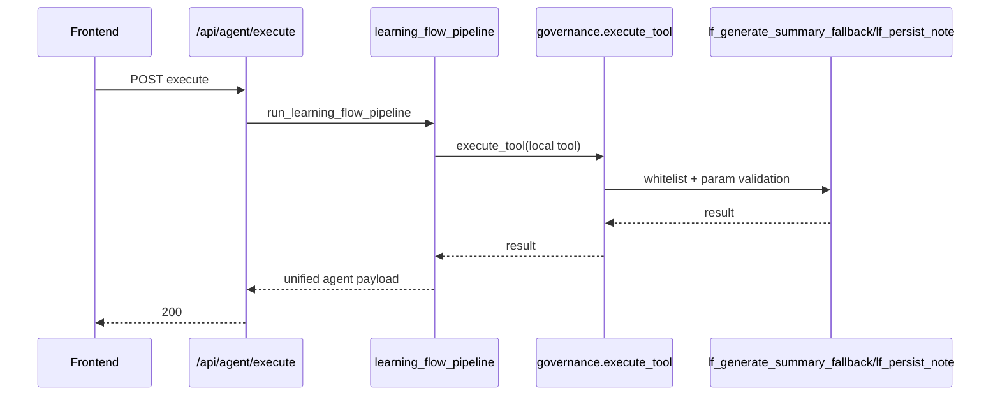
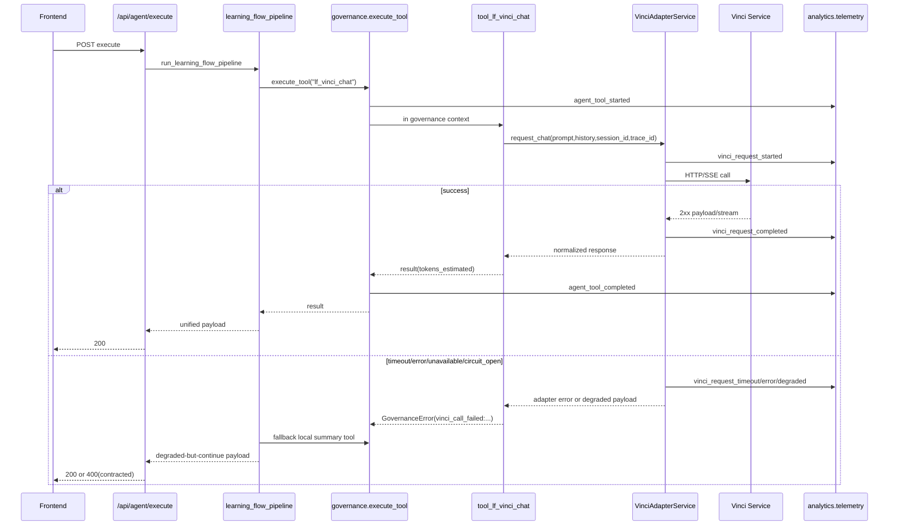

# Vinci Integration M5 - Architecture & Sequences

本文档用于 M5 交付收口，描述 EduMind 后端接入 Vinci 前后架构与关键时序。

## 1. 融合前（Before M1）

### 1.1 架构要点

- 学习流主链路存在 Planner/Executor/Validator，但仅调用本地工具。
- 外部能力未通过独立适配层，缺少统一错误码与降级契约。
- 治理边界在工具执行层，尚未覆盖 Vinci 能力。

### 1.2 时序（Before）

## 2. 融合后（After M1-M5）

### 2.1 架构要点

- 新增 Vinci 适配层：
  - `app/services/vinci_client.py`（HTTP/SSE）
  - `app/services/vinci_adapter_service.py`（标准化、错误映射、降级、熔断、遥测）
- Vinci 调用固定路径：
  - `learning_flow_pipeline -> governance.execute_tool("lf_vinci_chat") -> tool_lf_vinci_chat -> VinciAdapterService`
- 不可绕过治理：
  - 工具实现中 `ensure_in_governance_context()` 阻断直调。
- 可观测性统一：
  - `app.analytics.telemetry` 统一埋点，`/api/ops/vinci/metrics` 输出窗口指标。

### 2.2 逻辑分层

- API 层：路由、输入校验、HTTP 状态映射。
- Orchestration 层：Planner/Executor/Validator。
- Governance 层：白名单、参数校验、审计事件。
- Adapter 层：上游契约适配、错误码映射、降级/熔断。
- Observability 层：集中遥测、告警阈值、运维接口。

### 2.3 时序（After）

## 3. 边界与约束

- 前端仅调用 EduMind 后端 API，不直连 Vinci。
- Vinci 不与主后端强行共环境，作为独立微服务配置接入。
- 任何 Vinci 执行必须经过治理网关，绕过路径为禁止路径。

## 4. M5 交付结论

- 架构分层、治理边界、错误契约、可观测与回滚路径均已文档化。
- 详细契约与错误码见 `docs/VINCI_M5_API_CONTRACT_ERROR_CODES.md`。
